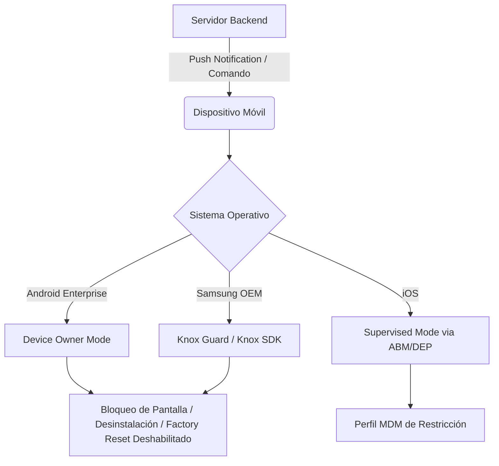
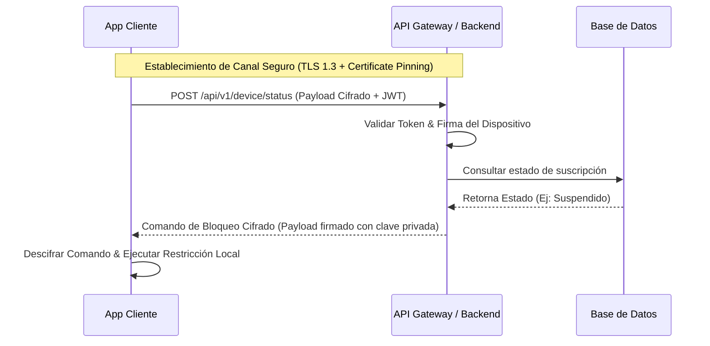
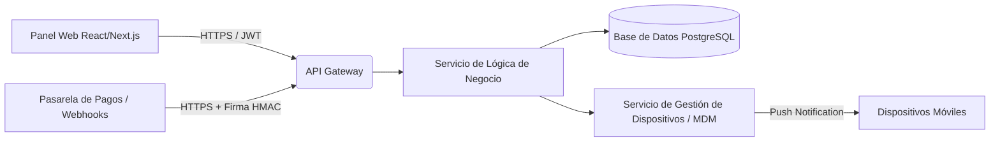

# Propuesta de Arquitectura: Sistema de Control de Dispositivos Financiados

Este documento detalla el diseño arquitectónico y de seguridad para un sistema integral de administración de dispositivos móviles (Android/iOS) adquiridos mediante financiamiento, asegurando el cumplimiento de pagos mediante el uso de APIs oficiales y prácticas recomendadas de seguridad.

---

## 1. Arquitectura del Cliente Móvil (Android & iOS)

Para implementar restricciones a nivel de sistema operativo (impedir desinstalación, bloquear el terminal y evitar el formateo/factory reset), no es posible utilizar aplicaciones estándar del App Store o Google Play debido al sandboxing. Se requiere el uso de APIs de administración empresarial (MDM) o integraciones a nivel de fabricante (OEM).

### Android: Configuración de Administración
*   **Android Enterprise (Device Owner Mode):** La aplicación cliente debe registrarse como un *Work Policy Controller* (WPC) configurado en modo *Device Owner* (Propietario del Dispositivo) durante el aprovisionamiento inicial (mediante código QR, NFC o Zero-Touch).
    *   **Prevención de Desinstalación:** Uso de `DevicePolicyManager.setUninstallBlocked(adminComponent, packageName, true)`.
    *   **Prevención de Formateo:** Aplicación del policy restriction `UserManager.DISALLOW_FACTORY_RESET`.
    *   **Bloqueo Remoto:** Implementación de una pantalla de bloqueo persistente (Overlay/Kiosk Mode) usando `DevicePolicyManager.setLockTaskPackages` para limitar el uso del dispositivo a la app de bloqueo y llamadas de emergencia.
*   **OEM SDKs (Recomendado para Android):**
    *   **Samsung Knox Guard / Knox SDK:** Permite control a nivel de firmware. Si el usuario intenta formatear el dispositivo, Knox Guard vuelve a bloquear el terminal inmediatamente al iniciar y conectarse a internet.
    *   **Google Device Lock Controller:** Diseñado específicamente para empresas de financiamiento de dispositivos (requiere aprobación directa de Google y operadores autorizados).

### iOS: Configuración de Administración
*   **Supervised Mode (Modo Supervisado):** El dispositivo iOS debe ser propiedad de la empresa e inscribirse a través de **Apple Business Manager (ABM)** o el Device Enrollment Program (DEP).
*   **Gestión por MDM (Mobile Device Management):** Las restricciones no las ejecuta una aplicación cliente autónoma, sino un perfil de configuración no removible instalado por el servidor MDM.
    *   **Prevención de Desinstalación:** Se configura mediante la política `allowAppRemoving = false` en el perfil de configuración.
    *   **Prevención de Formateo:** Restricción de acceso a la configuración del sistema o bloqueo de la opción de restablecimiento de fábrica a través del perfil MDM.
    *   **Bloqueo Remoto:** Uso del comando MDM `DeviceLock` o colocación del dispositivo en modo de aplicación única (Single App Mode / Kiosk Mode) mediante comandos del servidor.

---

## 2. API de Comunicaciones y Seguridad de Red

El canal de comunicación entre el servidor y los dispositivos móviles debe mitigar ataques de Man-in-the-Middle (MITM) y asegurar la autenticidad de los comandos.

*   **Protocolo de Red:** Uso estricto de HTTPS sobre **TLS 1.3**.
*   **Certificate Pinning:** Hardcodear la clave pública del certificado del servidor dentro de la aplicación (usando Network Security Configuration en Android y directivas de seguridad de red en iOS) para evitar la interceptación mediante proxies o certificados falsos instalados localmente.
*   **Autenticación de Comandos:**
    *   Cada comando enviado al dispositivo (Lock, Unlock, Wipe) debe incluir un token firmado digitalmente por el backend usando criptografía asimétrica (ej. **ECDSA con curva P-256**).
    *   El cliente móvil debe verificar la firma del comando localmente antes de ejecutar cualquier acción privilegiada.
*   **Canal Asíncrono (Push/Websockets):**
    *   Uso de **Firebase Cloud Messaging (FCM)** para Android y **Apple Push Notification service (APNs)** para iOS como disparador de comandos de alta prioridad.
    *   Al recibir el push silencioso, el cliente realiza una petición síncrona a la API cifrada para descargar el comando pendiente.

---

## 3. Arquitectura del Panel de Administración y Backend

El backend gestiona la lógica de negocio, los pagos y la comunicación con los dispositivos.

### Componentes de Software:
1.  **API Gateway:** Responsable del enrutamiento, rate limiting, validación de esquemas y terminación TLS.
2.  **Servicio de Lógica de Negocio (Backend):** Desarrollado en Node.js, Go o Python, expone endpoints RESTful.
3.  **Servicio MDM / Push:** Orquesta el envío de comandos a las pasarelas APNs y FCM.
4.  **Base de Datos Centralizada:** PostgreSQL con cifrado a nivel de almacenamiento (TDE) para resguardar la información de los clientes, dispositivos y transacciones.

### Integración con Pasarelas de Pago:
*   El backend expone endpoints de Webhooks para recibir confirmaciones de pago (ej. Stripe, MercadoPago, etc.).
*   **Proceso de Desbloqueo Automático:**
    1. La pasarela envía confirmación de pago firmada digitalmente con un secreto compartido (HMAC).
    2. El backend valida la firma del Webhook, actualiza el estado de la suscripción en la base de datos a `Activo`.
    3. El servicio MDM genera un comando firmado de desbloqueo y lo envía de inmediato vía push (APNs/FCM) al terminal correspondiente.

---

## 4. Protección y Monitoreo de Integridad

Para asegurar la robustez del sistema frente a técnicas de ingeniería inversa y manipulación:

### Ofuscación de Código
*   **Android:** Uso de **DexGuard** o **R8/ProGuard** avanzado para ofuscar nombres de clases, métodos y atributos, cifrar strings sensibles (URLs de la API, claves públicas) y aplicar técnicas de aplanamiento de flujo de control.
*   **iOS:** Uso de herramientas de ofuscar el flujo de compilación de Swift (como **SwiftShield** o herramientas basadas en LLVM) y deshabilitar símbolos de depuración en producción.

### Monitoreo de Integridad (Attestation APIs)
*   **Android (Play Integrity API):** Permite verificar que las peticiones provienen de un binario original instalado desde Google Play y que se ejecuta en un dispositivo Android genuino y no modificado (no rooteado, sin gestor de arranque desbloqueado).
*   **iOS (App Attest & DeviceCheck):** Asegura que el cliente no ha sido modificado y permite verificar la autenticidad del hardware de Apple antes de autorizar comandos de desbloqueo.
*   **Detección Local:** Implementación de librerías para detectar rastros de Root/Jailbreak en tiempo de ejecución (presencia de binarios `su`, herramientas como Cydia, Magisk, Frida) y bloquear la aplicación en caso de detección.
